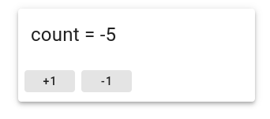
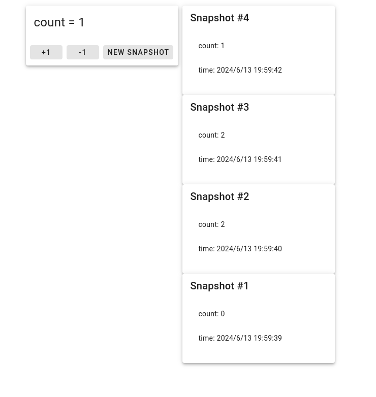

# vue-tutorial

Vueの練習用のプロジェクトです！

いくつかタスクを用意しておきました。

一応僕が作るならこうするというのを他のブランチに用意しておきましたので、参考にすると良いかもしれません

ちょっと変更するたびに、細かくスクショを #event/hackathon/24spring/14/progress に貼ってくれると助かります！

さらに、1つ改善するたびにcommitしてpushしてみましょう！

[Vue 入門 \| なろう講習会](https://traptitech.github.io/naro-text/chapter1/section2/0_vue-intro.html)が参考になると思います

## やってほしいこと

現在、簡単なカウンターが実装されています。

あなたには、次のことをしてほしいです。

### カウンターの見た目を良くする

ボタンに色を付けたり、ボタンと数字の配置を調整したりしてください！

[Vuetify](https://vuetifyjs.com/en/components/all/#containment)を使って作ると、簡単にいい感じの見た目になります！


作成例

### スナップショット機能を付けてみる

ボタンを追加して、それを押すと時刻・現在の数値が記録されスナップショットのリストに追加されるようにしてほしいです

ヒント：`new Date()`とすると現在時刻を記録したオブジェクトを作ることができます
ヒント2：各スナップショットをコンポーネントとして切り出すと良いと思います


作成例

## 準備

まず、このGitHub上の画面で右上の"Use this template"という緑のボタンを押して"Create a new repository"を選択してください。

色々入力する欄が出てくると思いますが、そのままにして右下の"Create repository"というボタンを押して大丈夫だと思います

そうしたらターミナルで適当な場所で`git clone git@github.com:[あなたのGitHub ID]/hackathon-vue-tutorial.git`を実行してください。`[あなたのGitHub ID]`の部分は、角カッコも含めてあなたのGitHub IDに置き換えてください。

cloneできたら、`cd hackathon-vue-tutorial`を実行しましょう。

## VSCodeのセットアップ

VSCodeでこのリポジトリを開いたときに、右下に"Install recommended extensions"みたいな内容のポップアップが出ると思うので、インストールする

## 開発方法

### 初回のセットアップ

```sh
npm install
```

### 開発用に一時的にサーバーを立てる

```sh
npm run dev
```

`http://localhost:xxxx`みたいなurlが表示されるので、それにアクセスするとベージが表示される

ファイルを編集すると自動で再読み込みされて、編集内容が反映されます

終了したい場合は、<kbd>Ctrl-C</kbd>

### フォーマットをする（自動でソースコードをきれいにする）

ファイルを保存したときにも自動的にフォーマットされますが、手動ですることもできます

```sh
npm run format
```
